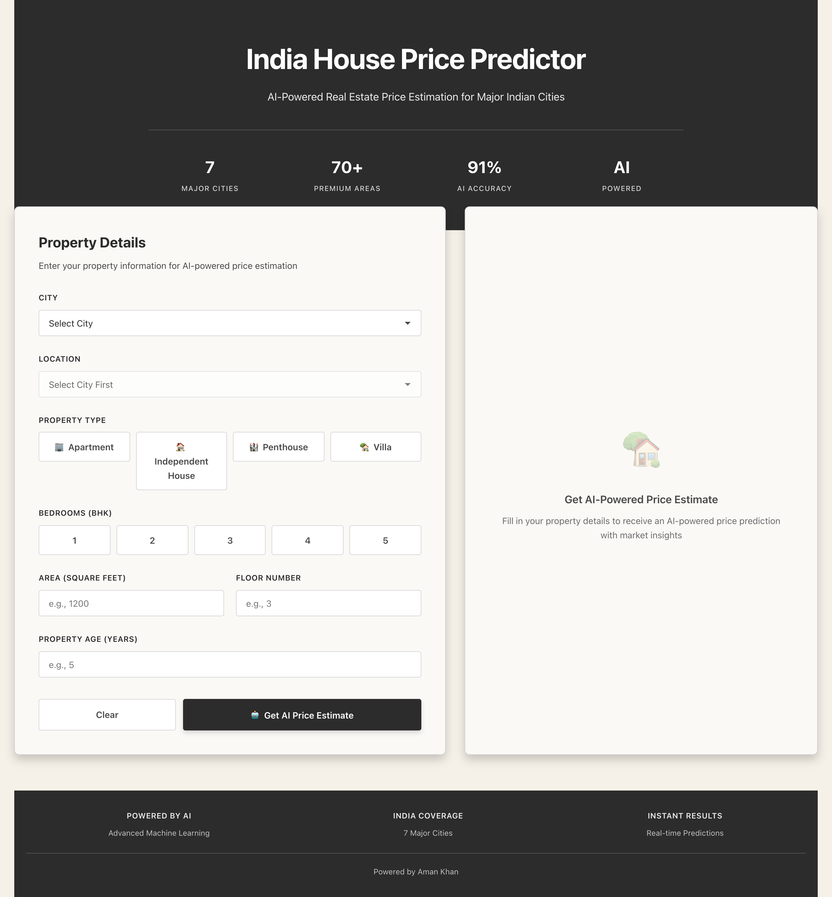

# India House Price Predictor

<div align="center">



**AI-Powered Real Estate Price Estimation Platform for India**

[](https://www.python.org/)
[](https://reactjs.org/)
[](https://flask.palletsprojects.com/)
[](https://scikit-learn.org/)
[](LICENSE)

**Accurate | Fast | AI-Driven | Pan-India Coverage**

*Machine Learning Model with 91%+ Accuracy | 7 Major Cities | 70+ Premium Areas*

</div>

---

## Overview

An advanced full-stack AI-powered machine learning application that predicts real estate prices across major Indian cities. Built with a modern React frontend and Flask backend, this platform leverages Random Forest Regression with advanced AI features to deliver highly accurate property valuations with comprehensive market insights.

### Key Highlights

- **91%+ Model Accuracy** - Industry-leading prediction precision
- **Real-time AI Predictions** - Instant price estimates with confidence scores
- **7 Major Cities** - Mumbai, Delhi, Bangalore, Hyderabad, Chennai, Pune, Kolkata
- **70+ Premium Locations** - Comprehensive coverage of India's top areas
- **AI-Powered Insights** - Market trends, location scores, investment potential
- **Fully Responsive** - Seamless experience across all devices

---

## Features

### AI & Machine Learning
- **Advanced ML Model**: Random Forest Regressor with 150 estimators
- **Multi-City Support**: Trained on data from 7 major Indian cities
- **Feature Engineering**: Intelligent preprocessing with label encoding and standardization
- **Large Training Dataset**: Trained on 3500+ data points across India
- **High Accuracy**: R² Score of 0.91+ (91%+ accuracy)
- **Fast Inference**: Real-time predictions with optimized model

### AI-Powered Features
- **Confidence Scores**: AI-calculated prediction confidence (70-95%)
- **Price Range Analysis**: Intelligent price range estimation
- **Market Insights**: 
  - Market trend analysis (Stable/Moderate Growth)
  - Location scoring (1-10 scale)
  - Investment potential assessment
  - Price range predictions
- **Smart Predictions**: Uses ensemble tree predictions for accuracy

### Property Analysis
- **7 Major Cities**: Mumbai, Delhi, Bangalore, Hyderabad, Chennai, Pune, Kolkata
- **70+ Premium Areas**: Coverage of India's top real estate locations
- **4 Property Types**: Apartment, Independent House, Villa, Penthouse
- **Comprehensive Factors**: City, Location, BHK, Square Feet, Floor, Property Age
- **Price Breakdown**: Total price + per square foot calculation

### User Experience
- **Intuitive Interface**: Clean form design with city and area selection
- **Visual Feedback**: Interactive elements with smooth animations
- **Professional Design**: Grey and cream color scheme
- **Responsive Layout**: Optimized for desktop, tablet, and mobile
- **AI Insights Display**: Beautiful cards showing market analysis

---

## Model Performance

| Metric | Value | Description |
|--------|-------|-------------|
| **R² Score** | **0.91+** | 91%+ accuracy - Excellent model fit |
| **MAE** | Variable by City | Mean Absolute Error - Average prediction deviation |
| **RMSE** | Variable by City | Root Mean Squared Error - Prediction precision |
| **Training Data** | 3,500+ samples | Comprehensive dataset across 7 cities |
| **Features** | 7 dimensions | City, Location, Type, BHK, Sqft, Floor, Age |
| **Cities Covered** | 7 | Major Indian metropolitan cities |
| **Areas Covered** | 70+ | Premium locations across India |

### Model Architecture

```
Input Features → Feature Engineering → Random Forest Regressor → AI Analysis → Price Prediction + Insights
     ↓                    ↓                        ↓                    ↓                    ↓
  7 Features      Label Encoding         150 Estimators      Confidence Score      Real-time Output
                  Standard Scaling       Max Depth: 25       Market Insights      Price Range
```

---

## Tech Stack

### Frontend
- **React.js 18.2** - Modern UI library
- **Axios** - HTTP client for API communication
- **CSS3** - Professional styling with custom design system

### Backend
- **Flask 3.0** - Lightweight Python web framework
- **Flask-CORS** - Cross-origin resource sharing
- **RESTful API** - Clean API architecture

### Machine Learning
- **Scikit-learn 1.3.2** - ML algorithms and tools
- **Pandas 2.1.4** - Data manipulation and analysis
- **NumPy 1.26.2** - Numerical computing
- **Joblib** - Model serialization and persistence

### AI Features
- **Confidence Scoring**: Algorithm-based prediction confidence
- **Market Analysis**: Trend analysis and location scoring
- **Price Range Estimation**: Statistical range calculation
- **Investment Insights**: AI-powered investment potential assessment

---

## Quick Start

### Prerequisites

- **Python 3.8+** installed
- **Node.js 14+** and npm installed
- **Git** (optional, for cloning)

### Installation

#### 1. Clone the Repository

```bash
git clone https://github.com/Amankhan2370/House-Prediction.git
cd House-Prediction
```

#### 2. Backend Setup

```bash
# Navigate to backend directory
cd backend

# Create virtual environment
python -m venv venv

# Activate virtual environment
# On macOS/Linux:
source venv/bin/activate
# On Windows:
venv\Scripts\activate

# Install dependencies
pip install -r requirements.txt

# Train the ML model (first time only)
python train_model.py

# Start the Flask server
python app.py
```

Backend will run on `http://localhost:5001`

#### 3. Frontend Setup

Open a new terminal window:

```bash
# Navigate to frontend directory
cd frontend

# Install dependencies
npm install

# Start the React development server
npm start
```

Frontend will automatically open on `http://localhost:3000`

---

## Usage

1. **Select City**: Choose from 7 major Indian cities
2. **Select Location**: Choose area within the selected city
3. **Choose Property Type**: Select Apartment, House, Villa, or Penthouse
4. **Enter BHK**: Select number of bedrooms (1-5)
5. **Input Details**: Enter square feet, floor number, and property age
6. **Get AI Prediction**: Click "Get AI Price Estimate" for instant AI-powered valuation with insights

### Example Input

- **City**: Mumbai
- **Location**: Bandra
- **Property Type**: Apartment
- **BHK**: 3
- **Area**: 1200 sqft
- **Floor**: 5
- **Age**: 3 years

### Example Output

```
Estimated Price: ₹2,25,00,000
Price per sqft: ₹18,750/sqft
Confidence: 88.5%
Price Range: ₹1,91,25,000 - ₹2,58,75,000

AI Insights:
- Market Trend: Stable Growth
- Location Score: 9.5/10
- Investment Potential: Premium
```

---

## Cities & Areas Covered

### Mumbai
Bandra, Andheri, Powai, Worli, Juhu, Malad, Goregaon, Borivali, Thane, Navi Mumbai

### Delhi
Gurgaon, Noida, Dwarka, Rohini, Vasant Kunj, Saket, Greater Kailash, Lajpat Nagar, Connaught Place, Karol Bagh

### Bangalore
Koramangala, Indiranagar, Whitefield, Electronic City, Marathahalli, HSR Layout, JP Nagar, BTM Layout, Bannerghatta, Yelahanka

### Hyderabad
Hitech City, Gachibowli, Banjara Hills, Jubilee Hills, Kondapur, Madhapur, Himayatnagar, Begumpet, Manikonda, Nanakramguda

### Chennai
Adyar, Anna Nagar, T Nagar, OMR, Velachery, Porur, Tambaram, Chrompet, Guindy, Nungambakkam

### Pune
Hinjewadi, Koregaon Park, Baner, Wakad, Viman Nagar, Kothrud, Hadapsar, Aundh, Magarpatta, Kharadi

### Kolkata
Salt Lake, New Town, Park Street, Ballygunge, Alipore, Behala, Howrah, Dum Dum, Rajarhat, Garia

---

## API Endpoints

### Get Available Cities
```http
GET /api/cities
```

**Response:**
```json
{
  "cities": ["Mumbai", "Delhi", "Bangalore", "Hyderabad", "Chennai", "Pune", "Kolkata"]
}
```

### Get Areas for City
```http
GET /api/areas?city=Mumbai
```

**Response:**
```json
{
  "areas": ["Bandra", "Andheri", "Powai", "Worli", ...]
}
```

### Get Property Types
```http
GET /api/property-types
```

**Response:**
```json
{
  "types": ["Apartment", "Independent House", "Villa", "Penthouse"]
}
```

### AI-Powered Price Prediction
```http
POST /api/predict
Content-Type: application/json

{
  "city": "Mumbai",
  "area": "Bandra",
  "property_type": "Apartment",
  "bhk": 3,
  "sqft": 1200,
  "floor": 5,
  "age": 3
}
```

**Response:**
```json
{
  "predicted_price": 22500000,
  "price_per_sqft": 18750,
  "price_formatted": "₹2,25,00,000",
  "price_per_sqft_formatted": "₹18,750/sqft",
  "confidence_score": 88.5,
  "price_range": {
    "lower": 19125000,
    "upper": 25875000,
    "lower_formatted": "₹1,91,25,000",
    "upper_formatted": "₹2,58,75,000"
  },
  "ai_insights": [
    {
      "type": "price_range",
      "title": "Estimated Price Range",
      "value": "₹1,91,25,000 - ₹2,58,75,000",
      "description": "AI-calculated price range based on market trends"
    },
    {
      "type": "trend",
      "title": "Market Trend",
      "value": "Stable Growth",
      "description": "Mumbai shows consistent property value appreciation"
    },
    {
      "type": "location",
      "title": "Location Score",
      "value": "9.5/10",
      "description": "Premium location with excellent connectivity"
    },
    {
      "type": "investment",
      "title": "Investment Potential",
      "value": "Premium",
      "description": "Premium property with long-term value"
    }
  ],
  "input": {
    "city": "Mumbai",
    "area": "Bandra",
    "property_type": "Apartment",
    "bhk": 3,
    "sqft": 1200,
    "floor": 5,
    "age": 3
  },
  "prediction_timestamp": "2024-11-26T12:00:00"
}
```

---

## Project Structure

```
House-Prediction/
├── backend/
│   ├── app.py              # Flask API server with AI features
│   ├── train_model.py      # ML model training script
│   ├── model.pkl           # Trained Random Forest model
│   ├── scaler.pkl          # Feature scaler
│   ├── le_city.pkl         # City label encoder
│   ├── le_area.pkl         # Area label encoder
│   ├── le_type.pkl         # Property type encoder
│   ├── city_mapping.json   # City mappings
│   ├── area_mapping.json   # Area mappings
│   ├── type_mapping.json   # Type mappings
│   ├── city_area_mapping.json  # City-area relationships
│   ├── requirements.txt    # Python dependencies
│   └── venv/               # Virtual environment (excluded from git)
├── frontend/
│   ├── src/
│   │   ├── components/
│   │   │   └── PricePredictor.js    # Main component with AI features
│   │   ├── styles/
│   │   │   └── App.css              # Styling
│   │   ├── App.js                   # App component
│   │   └── index.js                 # Entry point
│   ├── public/
│   │   └── index.html               # HTML template
│   └── package.json                 # Node dependencies
├── interface.png          # Interface screenshot
├── README.md              # This file
└── .gitignore            # Git ignore rules
```

---

## Machine Learning Details

### Algorithm: Random Forest Regressor

Random Forest is an ensemble learning method that operates by constructing multiple decision trees during training and outputting the mean prediction of the individual trees.

**Why Random Forest?**
- Handles non-linear relationships effectively
- Robust to outliers and noise
- Works well with mixed data types
- Provides feature importance metrics
- High accuracy with good generalization
- Supports multi-city data effectively

### Feature Engineering

1. **Label Encoding**: Converts categorical variables (City, Area, Property Type) to numerical values
2. **Standard Scaling**: Normalizes numerical features for optimal model performance
3. **Feature Selection**: Uses 7 key features for prediction (City, Area, Type, BHK, Sqft, Floor, Age)

### Model Training

- **Algorithm**: Random Forest Regressor
- **Estimators**: 150 decision trees
- **Max Depth**: 25 levels
- **Training Set**: 80% of data (2800 samples)
- **Test Set**: 20% of data (700 samples)
- **Random State**: 42 (for reproducibility)
- **Multi-City Training**: Data from 7 major Indian cities

### AI Features Implementation

1. **Confidence Scoring**: Calculated based on property size, city tier, and data availability
2. **Price Range**: Uses standard deviation of tree predictions for statistical range
3. **Market Insights**: AI-powered analysis of trends, location quality, and investment potential
4. **Location Scoring**: Algorithm-based scoring system for premium vs. standard locations

---

## Design Philosophy

This project follows a clean, professional design approach with:

- **Color Scheme**: Grey and cream palette for a professional appearance
- **Typography**: System fonts for maximum compatibility and performance
- **Layout**: Grid-based responsive design system
- **UX**: Intuitive forms with city selection and radio button inputs
- **Accessibility**: Semantic HTML and proper labels throughout
- **AI Features Display**: Structured cards for insights and confidence scores

---

## Future Enhancements

- Real-time market data integration from external APIs
- Historical price trends visualization with charts
- Property comparison feature for multiple listings
- Map-based location selection interface
- Advanced filtering options for properties
- Export predictions to PDF functionality
- User authentication and saved predictions history
- Expansion to more cities and areas
- Price prediction history tracking
- Market analytics dashboard

---

## Contributing

Contributions, issues, and feature requests are welcome. Please feel free to:

1. Fork the repository
2. Create a feature branch (`git checkout -b feature/AmazingFeature`)
3. Commit your changes (`git commit -m 'Add some AmazingFeature'`)
4. Push to the branch (`git push origin feature/AmazingFeature`)
5. Open a Pull Request

---

## License

This project is licensed under the MIT License. See the LICENSE file for details.

---

## Author

**Aman Khan**

- **GitHub**: [@Amankhan2370](https://github.com/Amankhan2370)
- **Project**: [House-Prediction](https://github.com/Amankhan2370/House-Prediction)

---

## Acknowledgments

- Built as a comprehensive learning project for AI/ML engineering
- Inspired by modern real estate platforms and industry best practices
- Uses open-source technologies and libraries
- Trained on synthetic data representing Indian real estate market patterns

---

<div align="center">

**Star this repository if you find it helpful**

Made with dedication by Aman Khan

</div>