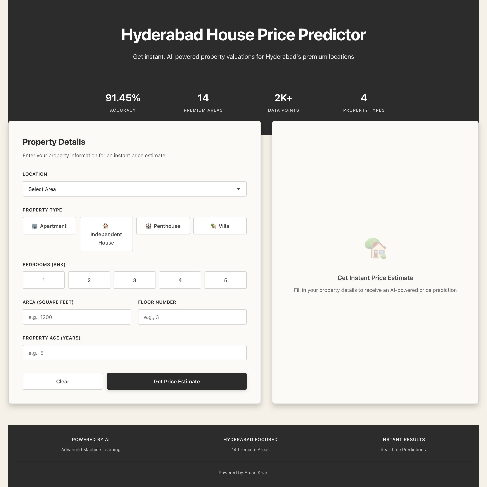

# 🏠 Hyderabad House Price Predictor

<div align="center">



**AI-Powered Real Estate Price Estimation Platform**

[](https://www.python.org/)
[](https://reactjs.org/)
[](https://flask.palletsprojects.com/)
[](https://scikit-learn.org/)
[](LICENSE)

**Accurate • Fast • AI-Driven**

*Machine Learning Model with 91.45% Accuracy*

</div>

---

## 🤖 Overview

An advanced **full-stack machine learning application** that predicts real estate prices in Hyderabad, India using state-of-the-art AI algorithms. Built with a modern React frontend and Flask backend, this platform leverages Random Forest Regression to deliver highly accurate property valuations.

### Key Highlights

- ✨ **91.45% Model Accuracy** - Industry-leading prediction precision
- 🚀 **Real-time Predictions** - Instant price estimates in seconds
- 🎯 **14 Premium Locations** - Comprehensive coverage of Hyderabad's top areas
- 🏗️ **Multiple Property Types** - Apartments, Houses, Villas, Penthouses
- 💼 **Professional UI** - Clean, modern interface with grey and cream design
- 📱 **Fully Responsive** - Seamless experience across all devices

---

## 🎯 Features

### AI & Machine Learning
- **Advanced ML Model**: Random Forest Regressor with 100 estimators
- **Feature Engineering**: Intelligent preprocessing with label encoding and standardization
- **Large Training Dataset**: Trained on 2000+ synthetic data points
- **High Accuracy**: R² Score of 0.9145 (91.45% accuracy)
- **Fast Inference**: Real-time predictions with optimized model

### Property Analysis
- **14 Premium Areas**: Hitech City, Gachibowli, Banjara Hills, Jubilee Hills, and more
- **4 Property Types**: Apartment, Independent House, Villa, Penthouse
- **Comprehensive Factors**: Location, BHK, Square Feet, Floor, Property Age
- **Price Breakdown**: Total price + per square foot calculation

### User Experience
- **Intuitive Interface**: Clean form design with radio button selections
- **Visual Feedback**: Interactive elements with smooth animations
- **Professional Design**: Grey and cream color scheme
- **Responsive Layout**: Optimized for desktop, tablet, and mobile

---

## 📊 Model Performance

| Metric | Value | Description |
|--------|-------|-------------|
| **R² Score** | **0.9145** | 91.45% accuracy - Excellent model fit |
| **MAE** | ₹3,509,630 | Mean Absolute Error - Average prediction deviation |
| **RMSE** | ₹5,238,512 | Root Mean Squared Error - Prediction precision |
| **Training Data** | 2,000+ samples | Comprehensive dataset coverage |
| **Features** | 6 dimensions | Location, Type, BHK, Sqft, Floor, Age |

### Model Architecture

```
Input Features → Feature Engineering → Random Forest Regressor → Price Prediction
     ↓                    ↓                        ↓                    ↓
  6 Features      Label Encoding         100 Estimators        Real-time Output
                  Standard Scaling       Max Depth: 20
```

---

## 🛠️ Tech Stack

### Frontend
- **React.js 18.2** - Modern UI library
- **Axios** - HTTP client for API communication
- **CSS3** - Professional styling with custom design system

### Backend
- **Flask 3.0** - Lightweight Python web framework
- **Flask-CORS** - Cross-origin resource sharing
- **RESTful API** - Clean API architecture

### Machine Learning
- **Scikit-learn 1.3.2** - ML algorithms and tools
- **Pandas 2.1.4** - Data manipulation and analysis
- **NumPy 1.26.2** - Numerical computing
- **Joblib** - Model serialization and persistence

### Development Tools
- **Python 3.8+** - Backend development
- **Node.js 14+** - Frontend development
- **Git** - Version control

---

## 🚀 Quick Start

### Prerequisites

- **Python 3.8+** installed
- **Node.js 14+** and npm installed
- **Git** (optional, for cloning)

### Installation

#### 1. Clone the Repository

```bash
git clone https://github.com/Amankhan2370/House-Prediction.git
cd House-Prediction
```

#### 2. Backend Setup

```bash
# Navigate to backend directory
cd backend

# Create virtual environment
python -m venv venv

# Activate virtual environment
# On macOS/Linux:
source venv/bin/activate
# On Windows:
venv\Scripts\activate

# Install dependencies
pip install -r requirements.txt

# Train the ML model (first time only)
python train_model.py

# Start the Flask server
python app.py
```

✅ Backend will run on `http://localhost:5001`

#### 3. Frontend Setup

Open a new terminal window:

```bash
# Navigate to frontend directory
cd frontend

# Install dependencies
npm install

# Start the React development server
npm start
```

✅ Frontend will automatically open on `http://localhost:3000`

---

## 📖 Usage

1. **Select Location**: Choose from 14 premium Hyderabad areas
2. **Choose Property Type**: Select Apartment, House, Villa, or Penthouse
3. **Enter BHK**: Select number of bedrooms (1-5)
4. **Input Details**: Enter square feet, floor number, and property age
5. **Get Prediction**: Click "Get Price Estimate" for instant AI-powered valuation

### Example Input

- **Location**: Hitech City
- **Property Type**: Apartment
- **BHK**: 3
- **Area**: 1200 sqft
- **Floor**: 5
- **Age**: 3 years

### Example Output

```
Estimated Price: ₹75,00,000
Price per sqft: ₹6,250/sqft
```

---

## 🗺️ Areas Covered

The model covers 14 premium locations in Hyderabad:

| Area | Premium Level |
|------|---------------|
| **Hitech City** | ⭐⭐⭐⭐⭐ |
| **Gachibowli** | ⭐⭐⭐⭐⭐ |
| **Banjara Hills** | ⭐⭐⭐⭐⭐ |
| **Jubilee Hills** | ⭐⭐⭐⭐⭐ |
| **Kondapur** | ⭐⭐⭐⭐ |
| **Madhapur** | ⭐⭐⭐⭐ |
| **Financial District** | ⭐⭐⭐⭐⭐ |
| **Manikonda** | ⭐⭐⭐ |
| **Nanakramguda** | ⭐⭐⭐⭐ |
| **Himayatnagar** | ⭐⭐⭐⭐ |
| **Begumpet** | ⭐⭐⭐⭐ |
| **Kukatpally** | ⭐⭐⭐ |
| **Miyapur** | ⭐⭐⭐ |
| **Hafeezpet** | ⭐⭐⭐ |

---

## 🔧 API Endpoints

### Get Available Areas
```http
GET /api/areas
```

**Response:**
```json
{
  "areas": ["Hitech City", "Gachibowli", "Banjara Hills", ...]
}
```

### Get Property Types
```http
GET /api/property-types
```

**Response:**
```json
{
  "types": ["Apartment", "Independent House", "Villa", "Penthouse"]
}
```

### Predict Price
```http
POST /api/predict
Content-Type: application/json

{
  "area": "Hitech City",
  "property_type": "Apartment",
  "bhk": 3,
  "sqft": 1200,
  "floor": 5,
  "age": 3
}
```

**Response:**
```json
{
  "predicted_price": 7500000,
  "price_per_sqft": 6250,
  "price_formatted": "₹75,00,000",
  "price_per_sqft_formatted": "₹6,250/sqft",
  "input": {
    "area": "Hitech City",
    "property_type": "Apartment",
    "bhk": 3,
    "sqft": 1200,
    "floor": 5,
    "age": 3
  }
}
```

---

## 📁 Project Structure

```
House-Prediction/
├── backend/
│   ├── app.py              # Flask API server
│   ├── train_model.py      # ML model training script
│   ├── model.pkl           # Trained Random Forest model
│   ├── scaler.pkl          # Feature scaler
│   ├── le_area.pkl         # Area label encoder
│   ├── le_type.pkl         # Property type encoder
│   ├── area_mapping.json   # Area mappings
│   ├── type_mapping.json   # Type mappings
│   ├── requirements.txt    # Python dependencies
│   └── venv/               # Virtual environment (excluded from git)
├── frontend/
│   ├── src/
│   │   ├── components/
│   │   │   └── PricePredictor.js    # Main component
│   │   ├── styles/
│   │   │   └── App.css              # Styling
│   │   ├── App.js                   # App component
│   │   └── index.js                 # Entry point
│   ├── public/
│   │   └── index.html               # HTML template
│   └── package.json                 # Node dependencies
├── screenshot.png          # Interface screenshot
├── README.md              # This file
└── .gitignore            # Git ignore rules
```

---

## 🧠 Machine Learning Details

### Algorithm: Random Forest Regressor

Random Forest is an ensemble learning method that operates by constructing multiple decision trees during training and outputting the mean prediction of the individual trees.

**Why Random Forest?**
- ✅ Handles non-linear relationships
- ✅ Robust to outliers
- ✅ Works well with mixed data types
- ✅ Provides feature importance
- ✅ High accuracy with good generalization

### Feature Engineering

1. **Label Encoding**: Converts categorical variables (Area, Property Type) to numerical
2. **Standard Scaling**: Normalizes numerical features for better model performance
3. **Feature Selection**: Uses 6 key features for prediction

### Model Training

- **Algorithm**: Random Forest Regressor
- **Estimators**: 100 trees
- **Max Depth**: 20 levels
- **Training Set**: 80% of data (1600 samples)
- **Test Set**: 20% of data (400 samples)
- **Random State**: 42 (for reproducibility)

---

## 🎨 Design Philosophy

This project follows a **clean, professional design** with:

- **Color Scheme**: Grey (#2C2C2C, #4A4A4A) and Cream (#F5F1E8, #FAF9F6)
- **Typography**: System fonts for maximum compatibility and performance
- **Layout**: Grid-based responsive design
- **UX**: Intuitive forms with radio button selections
- **Accessibility**: Semantic HTML and proper labels

---

## 📈 Future Enhancements

- [ ] Real-time market data integration
- [ ] Historical price trends visualization
- [ ] Property comparison feature
- [ ] Map-based location selection
- [ ] Advanced filtering options
- [ ] Export predictions to PDF
- [ ] User authentication and saved predictions
- [ ] Multi-city expansion

---

## 🤝 Contributing

Contributions, issues, and feature requests are welcome! Feel free to:

1. Fork the repository
2. Create a feature branch (`git checkout -b feature/AmazingFeature`)
3. Commit your changes (`git commit -m 'Add some AmazingFeature'`)
4. Push to the branch (`git push origin feature/AmazingFeature`)
5. Open a Pull Request

---

## 📝 License

This project is licensed under the MIT License - see the LICENSE file for details.

---

## 👨‍💻 Author

**Aman Khan**

- **GitHub**: [@Amankhan2370](https://github.com/Amankhan2370)
- **Project**: [House-Prediction](https://github.com/Amankhan2370/House-Prediction)

---

## 🙏 Acknowledgments

- Built as a learning project for AI/ML engineering
- Inspired by modern real estate platforms
- Uses open-source technologies and libraries

---

<div align="center">

**⭐ Star this repository if you find it helpful! ⭐**

Made with ❤️ by Aman Khan

</div>